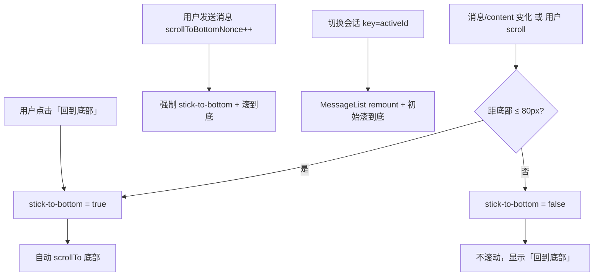

# Change 1.4：聊天列表自动滚动与「回到底部」优化

> Phase：1 ChatBot　|　分支：`feature_ai_api_streaming_260724`  
> 关联 Change：1.4 AI API 集成与流式输出  
> 涉及文件：`components/chat/MessageList.tsx`、`components/layout/MainPanel.tsx`、`app/page.tsx`  
> 日期：2026-07-26

---

## 1. 背景

Change 1.4 接入了 **SSE 流式 AI 回复**：`chatStore` 每收到一个 `token` 事件，就把 assistant 消息的 `content` 追加一段文字，React 重渲染 `MessageList`。

Chat 产品的消息列表有一个基础 UX 预期：

- **默认在底部**：用户发消息后，应看到自己刚发的内容和 AI 正在生成的回复。
- **流式跟随**：AI 逐字输出时，若用户「正在看最新内容」，视口应跟着长文本往下走。
- **不打断阅读**：若用户向上滚动查看历史，流式输出**不应**把视口强行拽回底部——这是 ChatGPT、Claude 等产品的通行做法。

本优化分**两次迭代**完成：第一次解决「完全不跟滚」；第二次对齐 ChatGPT 的「智能跟随 + 回到底部按钮」。

---

## 2. 问题

### 2.1 第一次发现的问题：流式输出时列表不跟滚

**现象：**

- 用户发送消息后，视口停在发送前的位置。
- AI 回复在列表底部不断增长，但用户看不到新 token，必须手动滚到底。

**根因：**

- 1.3 阶段 `MessageList` 只是静态渲染 `messages`，没有任何滚动逻辑。
- 1.4 接入流式后，DOM 高度随 `content.length` 增长，但**没有人调用 scroll API**，浏览器不会自动把视口锚在底部。

### 2.2 第一次修复引入的新问题：无条件自动滚

**现象（若只做 naive 自动滚）：**

- 每次 token 到达都 `scrollIntoView` / `scrollTo` 到底部。
- 用户向上翻看历史时，每来一个 token 视口就被拽回底部，**无法稳定阅读**。

**本质矛盾：**

| 场景 | 期望行为 |
|------|----------|
| 用户在底部附近 | 自动跟随流式输出 |
| 用户向上阅读历史 | 保持当前 scrollTop，显示「回到底部」 |
| 用户发送新消息 | 强制滚到底，恢复跟随 |
| 切换会话 | 滚到该会话底部，重置状态 |

所以需要 **stick-to-bottom（粘底）** 语义，而不是「有更新就滚」。

---

## 3. 方案概览

参考 ChatGPT 的做法，采用 **「底部附近才自动滚 + 回到底部按钮」** 两阶段实现。



### 3.1 第一次优化（基础跟滚）

**目标：** 流式时有内容增长，列表能跟到底部。

**做法：**

- `MessageList` 加 `"use client"`，用 `ref` 指向底部哨兵或滚动容器。
- 监听 `messages.length` 与最后一条消息的 `content.length`，变化时触发滚动。
- 通过 `isStreaming` prop 区分滚动行为：流式用 `behavior: "auto"`（即时），非流式用 `"smooth"`。

**局限：** 未判断用户是否在底部，会打断向上阅读。

### 3.2 第二次优化（ChatGPT 式智能滚）

**目标：** 只在「底部附近」自动跟滚；否则显示「回到底部」。

**核心设计：**

1. **滚动容器下沉到 `MessageList`**  
   原先 `MainPanel` 的 `overflow-y-auto` 改为 `MessageList` 内部自持，便于精确读 `scrollTop` / `scrollHeight`。

2. **底部附近判定**  
   `scrollHeight - scrollTop - clientHeight ≤ 80px` → 视为在底部附近（常量 `NEAR_BOTTOM_THRESHOLD_PX`）。

3. **双轨状态**  
   - `isNearBottomRef`（ref）：决定是否自动跟滚，避免 effect 闭包陈旧。  
   - `showScrollToBottom`（state）：控制按钮显隐，仅在 `onScroll` 和用户点击时更新。

4. **强制粘底触发**  
   - 发送消息：`page.tsx` 递增 `scrollToBottomNonce` → `MessageList` effect 强制滚到底。  
   - 切换会话：`<MessageList key={activeId} />` remount，mount 时滚到底并重置状态。

5. **「回到底部」按钮**  
   悬浮在列表底部中央；点击后 `smooth` 滚到底，恢复 stick-to-bottom。

---

## 4. 实现细节

### 4.1 关键常量与判定函数

```ts
const NEAR_BOTTOM_THRESHOLD_PX = 80;

function isNearBottom(element: HTMLElement): boolean {
  const distance =
    element.scrollHeight - element.scrollTop - element.clientHeight;
  return distance <= NEAR_BOTTOM_THRESHOLD_PX;
}
```

**为什么用 80px 而不是 0？**  
用户手指/滚轮很难精确停在 `scrollTop === max`；留容差后，「几乎在底部」仍算粘底，减少误显示按钮。ChatGPT 类产品通常也有类似 threshold（具体数值各产品略有不同）。

### 4.2 滚动触发器：`contentScrollTrigger`

```ts
const lastMessage = messages[messages.length - 1];
const contentScrollTrigger = `${messages.length}:${lastMessage?.content.length ?? 0}`;
```

- `messages.length` 变化 → 新消息（user / assistant 占位）。
- `content.length` 变化 → 流式 token 追加。

合并成字符串作为 effect 依赖，避免对 `messages` 深比较，也避免单独监听 store 内部对象引用。

### 4.3 三个 effect 的分工

| Effect | 依赖 | 行为 |
|--------|------|------|
| 挂载 | `[scrollToBottom]` | 初次 / remount 时 `scrollToBottom("auto")` |
| 发送消息 | `[scrollToBottomNonce, ...]` | `isNearBottomRef = true`，强制滚到底 |
| 内容变化 | `[contentScrollTrigger, isStreaming, ...]` | **仅当** `isNearBottomRef.current === true` 时才滚 |

**刻意不在 content effect 里 `setShowScrollToBottom`：**  
按钮显隐交给 `onScroll`；若用户已离开底部，content 增长时不应抢焦点去改 state，也避免 React 19 lint 对「effect 内同步 setState」报错。

### 4.4 流式用 `auto`、非流式用 `smooth`

```ts
scrollToBottom(isStreaming ? "auto" : "smooth");
```

- 流式每几十毫秒来一次 token，若用 `smooth`，浏览器会排队多个平滑动画，表现为**滚动滞后、抖动**。
- `auto` 是即时跳转，视觉上像「粘着底部往下长」。

### 4.5 布局调整

**Before（MainPanel 滚动）：**

```tsx
<div className="min-h-0 flex-1 overflow-y-auto px-4 py-4 md:px-6">
  {messages}
</div>
```

**After：**

```tsx
// MainPanel：只负责 flex 占位
<div className="relative min-h-0 flex-1">{messages}</div>

// MessageList：自持滚动 + 悬浮按钮
<div className="relative h-full min-h-0">
  <div ref={scrollRef} onScroll={handleScroll} className="h-full overflow-y-auto ...">
    ...
  </div>
  {showScrollToBottom ? <Button>回到底部</Button> : null}
</div>
```

`min-h-0` 是 flex 子项能正确收缩、出现滚动条的关键；缺了它，列表会把父容器撑开而不是内部滚动。

### 4.6 父组件配合（`app/page.tsx`）

```tsx
const [scrollToBottomNonce, setScrollToBottomNonce] = useState(0);

function handleSubmitMessage(content: string) {
  // ...
  setScrollToBottomNonce((n) => n + 1);
  void sendMessage(activeId, content);
}

<MessageList
  key={activeId ?? "none"}
  messages={activeMessages}
  isStreaming={isStreaming}
  scrollToBottomNonce={scrollToBottomNonce}
/>
```

- **`scrollToBottomNonce`**：发送消息的「强制粘底」信号；用递增数字而非 boolean，保证连续发送每次都能触发 effect。
- **`key={activeId}`**：切换会话时 remount，清空 `showScrollToBottom`、重置 `isNearBottomRef`，并执行 mount 滚到底——比 `conversationId` prop + effect 更简单，也避免 effect 里批量 reset state。

### 4.7 「回到底部」按钮的交互细节

- 外层 `pointer-events-none`，按钮本身 `pointer-events-auto`：不挡列表下方内容的选中/点击。
- `aria-label="回到底部"`：屏幕阅读器可访问。
- 点击时同步：`isNearBottomRef = true` → 隐藏按钮 → `smooth` 滚到底。

---

## 5. 带来的效果

| 场景 | 优化前 | 优化后 |
|------|--------|--------|
| 流式生成，用户在底部 | 不跟滚，看不到新内容 | 即时粘底跟随 |
| 流式生成，用户向上看历史 | （若 naive 实现）每 token 被拽回底部 | 视口不动，出现「回到底部」 |
| 点击「回到底部」 | 无 | smooth 回到底并恢复跟随 |
| 发送新消息 | 可能停在中间 | 强制滚到底 |
| 切换会话 | 可能保留上一会话的 scroll 位置 | remount 后滚到该会话底部 |
| 流式性能 | smooth 动画堆积（若误用） | `auto` 即时，无动画排队 |

**体验对齐：** 与 ChatGPT 网页版的核心滚动语义一致——**默认粘底、阅读时放手、一键回到底**。

**工程侧：** 逻辑收敛在 `MessageList` 单组件；OpenSpec 1.4 已补充 `chat-components` 需求、`design.md` §10、`tasks.md` 6.6 / 7.7。

---

## 6. 面试官追问与解答

> 建议回答结构：**结论 → 原理 → 结合本项目 → trade-off / 延伸**。

---

### Q1：流式聊天列表为什么要单独做滚动逻辑？React 不会自动跟吗？

**答：**

- **结论：** 不会。DOM 变高只改变 `scrollHeight`，**不会**改变 `scrollTop`；视口位置是浏览器滚动状态，React 重渲染默认保留。
- **原理：** 列表是「在固定高度容器内 overflow 滚动」；新内容加在底部，只有主动 `scrollTo` / 改 `scrollTop` 才会移动视口。
- **结合项目：** `chatStore` 每来一个 SSE `token` 就 append `content`，触发 `MessageList` 重渲染；我们在 `contentScrollTrigger` effect 里在粘底时调用 `scrollTo`。
- **延伸：** 若用「反向 flex + column-reverse」等技巧可部分改变语义，但主流 Chat 产品仍选 scroll 容器 + 粘底判断，可读性更好。

---

### Q2：怎么判断用户「在不在底部」？为什么不用 `IntersectionObserver`？

**答：**

- **结论：** 本项目用算术：`scrollHeight - scrollTop - clientHeight ≤ 80`；每次 `onScroll` 更新 ref 和按钮状态。
- **原理：** 三者差值就是「距底部的像素距离」；加 threshold 避免「差 1px 就不跟滚」的抖动。
- **IO 方案：** 可在列表底部放 sentinel，`IntersectionObserver` 观察其是否可见。优点是与 DOM 解耦；缺点是还要处理 root、threshold、流式高频更新时的 callback 频率。
- **trade-off：** 算术法在 scroll 容器 ref 已知时最直接；ChatGPT 类产品两种都有，面试时说清「我们容器固定，算术足够」即可。

---

### Q3：为什么用 `ref` 存 `isNearBottom`，又用 `state` 存按钮显隐？

**答：**

- **结论：** ref 给 **effect 里的跟滚决策**（读最新值、不触发重渲染）；state 给 **按钮 UI**（必须重渲染才显示/隐藏）。
- **原理：** content 变化 effect 若依赖 state 里的「是否在底部」，容易闭包陈旧或造成 effect ↔ setState 循环；ref 在 scroll 回调里同步写入，effect 读 `isNearBottomRef.current` 总是最新。
- **结合项目：** `handleScroll` 写 ref + `setShowScrollToBottom`；content effect 只读 ref，决定是否 `scrollTo`。
- **减分项：** 说「全部用 state 就行」——高频 token 下会导致多余 render 或 lint/逻辑问题。

---

### Q4：`scrollToBottomNonce` 是什么？为什么不用 boolean 或 callback ref？

**答：**

- **结论：** 父组件发送前 `setScrollToBottomNonce(n => n + 1)`，子组件 effect 依赖该数字，每次发送都会触发「强制粘底」。
- **原理：** boolean 从 `false → true` 只触发一次，连续发两条消息第二次可能不触发；nonce 递增保证每次 send 都是新依赖值。
- **备选：** `useImperativeHandle` + `ref.scrollToBottom()` 也可以，但跨组件命令式 API 更重；nonce 是 React 里常见的「事件脉冲」模式。
- **结合项目：** 与 `key={activeId}` 分工——nonce 管「同会话内发送」，key 管「跨会话 reset」。

---

### Q5：切换会话为什么用 `key={activeId}` remount，而不是 `useEffect([conversationId])`？

**答：**

- **结论：** remount 一次性重置所有本地 scroll 状态（ref 初值、按钮 hidden、mount 滚到底），不用在 effect 里连环 `setState`。
- **原理：** `key` 变化 = 卸载旧实例、挂载新实例；适合「切换 tab 级」的 UI 状态隔离。
- **trade-off：** remount 会重建 DOM，极长列表可能有轻微成本；1.4 消息在内存、规模可控。若 1.5 持久化后单会话消息很多，可改为保留实例 + 显式 reset，并配合虚拟列表。
- **lint 侧：** 我们在实现时遇到过 React 19 `react-hooks/set-state-in-effect` 规则——在 `conversationId` effect 里同步 `setShowScrollToBottom(false)` 会报错；用 key remount 更干净。

---

### Q6：流式为什么用 `scrollBehavior: 'auto'` 而不是 `smooth`？

**答：**

- **结论：** token 高频到达时，`smooth` 会叠加多个进行中的动画，滚动**追不上**内容增长，反而卡顿。
- **原理：** `smooth` 适合用户主动触发的单次滚动（如点「回到底部」）；`auto` 是瞬时设 `scrollTop`，适合 60ms 一更新的流式场景。
- **结合项目：** content effect 和 nonce effect 在 `isStreaming` 为 true 时用 `auto`；非流式新消息可用 `smooth`。
- **加分：** 提到可 throttle token 合并 render（100ms 一批）进一步减 scroll 次数——属于性能优化，非 1.4 必需。

---

### Q7：如果用户正在底部，但图片/代码块异步撑高，会不会「脱底」？

**答：**

- **结论：** 会。当前 1.4 只有纯文本 bubble，高度与 content 同步；若 1.6 加 Markdown/图片，异步加载后 `scrollHeight` 变大，可能出现「本来粘底但突然离底几十 px」。
- **应对：**  
  1. 图片 `onLoad` 后若 `isNearBottomRef` 为 true 再滚一次；  
  2. `ResizeObserver` 观察列表内容区，粘底时补滚；  
  3. 仍用同一套 80px threshold，scroll/resize 后重新判定。
- **面试价值：** 展示你知道「文本流式 ≠ 布局稳定」，有后续 Change 意识。

---

### Q8：虚拟列表（react-window）和这套粘底逻辑怎么共存？

**答：**

- **结论：** 虚拟列表只渲染视口附近 DOM，**不能**简单对 `scrollHeight` 滚到 `Infinity`；粘底语义变为「滚动到最后一条消息的 index」。
- **原理：** 虚拟列表库通常提供 `scrollToItem({ index, align: 'end' })`；粘底判断改为「最后一条是否可见」或「scrollOffset 距 max 小于 threshold」。
- **结合 roadmap：** 1.4 全量渲染内存消息；消息量上来后（1.5+）再引入虚拟化，粘底 API 换实现，**产品语义不变**。详见本文 [§7 虚拟滚动](#7-虚拟滚动是否需要何时引入)。
- **加分：** 提到 ChatGPT 长对话也可能虚拟化 + 粘底，关键是 **stick-to-bottom 是产品状态，不是某个 scroll API 的固定写法**。

---

### Q9：Accessibility 上有什么要注意的？

**答：**

- 按钮有可见文案「回到底部」+ `aria-label`。
- 流式更新时，**不要**对每条 token 做 `aria-live="polite"` 朗读（会炸屏幕阅读器）；应对整段 assistant 消息在 `done` 后通知，或 live region 节流。
- 键盘：按钮需可 focus、Enter/Space 触发（原生 `<button>` 已满足）。

---

### Q10：怎么测这套滚动？你会写单测还是 E2E？

**答：**

- **单测（RTL）：** mock `scrollHeight/clientHeight/scrollTop`，fireEvent.scroll，断言 `showScrollToBottom` 与是否调用 `scrollTo`；nonce 变化时断言 `isNearBottomRef` 行为。DOM 尺寸在 jsdom 里常是 0，需要 mock 几何属性。
- **E2E（Playwright）：** 发消息 → 断言最后一条 bubble 在视口内；向上滚 → 流式继续 → 断言 scroll 位置不变且按钮出现 → 点击按钮 → 断言回到底。
- **手动（OpenSpec 7.7）：** 底部跟随、向上不打断、发送强制到底、切换会话——四条场景。
- **trade-off：** 滚动 UX 更依赖 E2E；单元测试适合锁「判定函数 isNearBottom」逻辑。

---

## 7. 虚拟滚动：是否需要、何时引入

> **结论（针对本项目）：** Change 1.4 **不需要**上虚拟滚动。优先做 1.5 **分页加载**与 1.7 **上下文截断**；只有「单会话超长、必须全量展示、且实测卡顿」时，再在 1.8 或性能专项中引入（推荐 `react-virtuoso` 一类变高列表方案）。

### 7.1 虚拟滚动是什么

**虚拟滚动（Virtual Scrolling / Windowing）** 只渲染**视口附近**那一小段 DOM。列表数据可以有 1 万条，但 DOM 里可能始终只有 20～30 个节点；滚动时复用或替换节点，而不是 `messages.map()` 全量挂载。

常见库：

| 库 | 特点 |
|----|------|
| `@tanstack/react-virtual` |  headless，灵活，需自己拼 UI |
| `react-virtuoso` | 适合**变高**列表，Chat 场景常用 |
| `react-window` | 轻量，更适合**固定行高**表格 |

### 7.2 一般应用在什么场景

| 场景 | 为什么需要 |
|------|------------|
| 超长列表（表格、日志、Feed） | DOM 节点数是主要瓶颈 |
| 单页数千～上万条且都在内存 | 全量 `map` 导致首屏慢、滚动掉帧、内存高 |
| 单会话极长且必须「一条连续时间线」展示 | 不想用「加载更多」分页打断体验 |
| 移动端弱设备 + 重 DOM 节点 | 如 1.6 后 Markdown、代码块、图片 |

**通常不需要：**

- 列表常态只有几十～一两百条
- 已用**分页 / 加载更多**控制内存中的消息量
- 产品仍在快速迭代 UI，虚拟列表接入与维护成本高

### 7.3 Chat 场景为什么比普通列表更难

1. **高度不固定** — 每条消息长短不一；1.6 还有代码块、列表、图片。
2. **流式输出** — 最后一条消息高度持续变化，需反复测量或触发虚拟列表重算。
3. **粘底逻辑** — 不能简单 `scrollTo(scrollHeight)`，需 `scrollToIndex(last)` + 必要时 `ResizeObserver` 补滚。
4. **实现选型** — Chat 更常选 **`react-virtuoso`**（变高友好），而非固定行高的 `react-window`。

**stick-to-bottom 是产品状态，不是某个 scroll API 的固定写法** — 换虚拟列表时，粘底语义不变，只是底层从 `scrollTo` 换成 `scrollToIndex` / `followOutput`。

### 7.4 本项目各阶段要不要加

#### Change 1.4（当前）— 不需要

- 消息仅在内存，刷新即丢。
- `MessageBubble` 为纯文本，DOM 很轻。
- 典型会话几十轮对话，全量渲染无压力。
- 已实现的粘底 +「回到底部」基于普通 scroll 容器，简单可靠。

#### Change 1.5 消息持久化 — 仍不优先虚拟滚动

Roadmap 1.5 规划的是 **分页加载**（首次拉最近 N 条，向上滚加载更早历史）。这从**数据源**限制 DOM 规模，多数 Chat 产品到这一步就够用：

```text
用户打开会话 → API 返回最近 50 条 → 渲染 50 个 bubble
向上滚到顶   → 再请求更早 50 条 → prepend 到列表
```

#### Change 1.6 Markdown + 代码高亮 — 观察，不预防性上

单条消息 DOM 变重，但配合 1.5 分页 + 1.7 Token 截断，同时挂在 DOM 上的条数仍可控。若 profiling 无问题，不必提前引入虚拟列表。

#### 何时才值得加？

同时满足**多条**时再考虑：

1. 产品要求单会话**完整历史**全部展示，且不接受分页 UX。
2. 实测单会话 **500+ 条**（或带 Markdown 后更少）滚动明显卡顿。
3. 法律长案情梳理等场景，用户会持续堆极长对话。

**建议时机：** Change **1.8 用户体验优化**，或 1.6 完成后若 Performance 面板出现 Long Task / 掉帧，单独开性能小 change。

### 7.5 分页 vs 虚拟滚动：怎么选

```text
消息很多时的两条路线：

A. 分页（1.5 规划）              B. 虚拟滚动
   只加载/渲染最近 N 条              全量在内存，只渲染视口
   实现简单，与 API 自然配合         前端复杂（尤其 + 流式 + 变高）
   向上滚需「加载更多」              体验像一条连续时间线
```

**本项目推荐顺序：**

1. **1.5 分页** — 先解决「加载多少数据」
2. **1.7 上下文截断** — 限制发给模型的历史长度
3. **实测卡顿后再上虚拟滚动** — 作为 1.8 或性能专项

### 7.6 若未来引入，与现有粘底如何衔接

| 现有（1.4） | 虚拟列表化后 |
|-------------|--------------|
| `scrollHeight - scrollTop - clientHeight ≤ 80` | 「最后一条 index 是否可见」或库提供的 `atBottom` |
| `scrollTo({ top: scrollHeight })` | `virtuosoRef.scrollToIndex({ index: 'LAST', align: 'end' })` |
| `content.length` 变化时 effect 滚到底 | `followOutput="smooth"` / 流式时用 `auto` |
| `key={activeId}` remount | 仍可用，或改为 `scrollToIndex(0)` 显式 reset |

产品行为保持不变：**默认粘底、阅读时放手、一键回到底**。

### 7.7 面试一句话

> 「虚拟滚动解决的是 **DOM 过多** 的渲染性能问题。Chat 因变高 + 流式，接入成本高于表格。我们 Phase 1 先用 1.5 分页控制数据量，1.4 全量渲染在典型规模下足够；若单会话超长成为刚需，会用 Virtuoso 一类库，粘底语义不变，只是 scroll API 换成 `scrollToIndex`。」

---

## 8. 相关文档

- [1.4 AI API 集成与流式输出](./1.4-ai-api-streaming.md)
- [1.4 面试追问与解答思路](./1.4-interview-followup.md)
- OpenSpec：`openspec/changes/ai-api-streaming/specs/chat-components/spec.md`（智能滚动需求）
- OpenSpec：`openspec/changes/ai-api-streaming/design.md` §10

---

## 9. 标签

`#chat-ux` `#scroll` `#streaming` `#stick-to-bottom` `#react` `#MessageList` `#interview` `#virtual-scroll` `#pagination`

**状态：** #待复习  
**日期：** 2026-07-26
