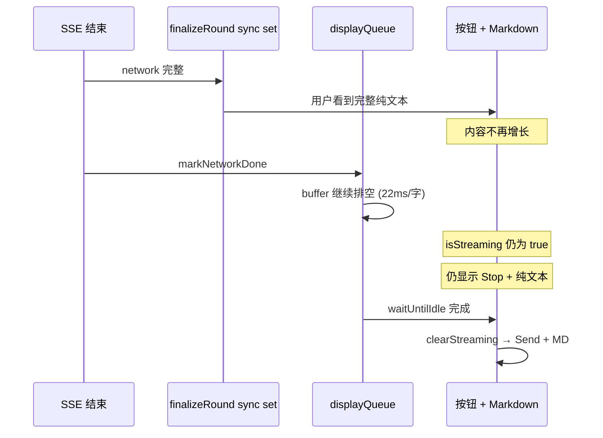

# Change 1.4×1.5×1.6：流式 UI 状态不同步（「已输完仍 Stop + 纯文本」）

> Phase：1 ChatBot  
> 涉及：`lib/stores/chatStore.ts`、`lib/streaming/displayQueue.ts`、`components/chat/MessageList.tsx`、`components/chat/ChatInput.tsx`  
> 关联 Change：1.4 展示队列、1.5 落库方案 B、1.6 流式纯文本 / 完成后 Markdown  
> 日期：2026-07-30

---

## §0 Executive Summary

**问题：** SSE 接口已结束、assistant 文字也不再增长，但页面仍显示「停止生成」，且消息保持纯文本，需再等数秒才切 Markdown +「发送」。

**根因：** 「内容是否完整」与「是否仍处于流式 UI 状态」绑定了**两个不同层**——`finalizeRound` 会**提前**把完整网络文本写入 state（视觉已结束），而 `streamingConversationId` / `useMarkdown` 仍等待 `displayQueue` 打字机 buffer 排空或 `waitUntilIdle()`。

**方案：** Network 结束后立刻 `markNetworkDone()` → `flushSync()` → `clearStreamingIfMatch()`，再异步 `finalizeRound()` 落库。

**效果：** 流式 UI 状态与「用户看到的内容已完整」对齐；消除 0～数秒不等的「幽灵流式」空窗期。

---

## 1. 修改前的现象

### 1.1 用户可感知表现

| 维度 | 表现 |
|------|------|
| Network | DevTools 中 `/api/chat` SSE 已结束，`done` 事件已收到 |
| 消息内容 | assistant 气泡文字**已全部出现**，且**不再增长** |
| 输入区按钮 | 仍显示 **「停止生成」**，而非「发送」 |
| 消息格式 | assistant 仍为 **纯文本**（`<p>`），无 Markdown 排版 / 代码高亮 |
| 延迟后 | 等待 **数秒** 后按钮变「发送」，消息**突然**变为 Markdown |

### 1.2 易误判方向

| 误判 | 实际 |
|------|------|
| 接口没返回完 | ❌ Network 已结束 |
| 打字机还在逐字输出 | ❌ 文字已不再增长（用户二次确认） |
| Markdown 解析挂了 | ❌ 延迟后能正常渲染，说明解析链正常 |
| React 没 re-render | ❌ 状态变 `isStreaming=false` 后会立刻切 MD |

本质是 **状态机阶段错位**，不是网络或 Markdown 库故障。

---

## 2. 如何探索问题所在

### 2.1 分层定位：四条独立时钟

```text
① 模型 / SSE     token 到达 → stream done
② chatStore 网络  networkAssistantText 完整
③ displayQueue   buffer 按 ~22ms/字 reveal
④ UI 状态        streamingConversationId、useMarkdown
```

**关键问题：** 用户看到的「输完」对应哪一层？按钮 / Markdown 又绑定哪一层？

### 2.2 代码阅读路径（推荐顺序）

1. **`ChatInput.tsx`** — `showStop = isStreaming && inputEmpty` → 按钮由 `streamingConversationId` 驱动  
2. **`page.tsx`** — `isStreaming = streamingConversationId === activeId`  
3. **`MessageList.tsx`** — 流式期间最后一条 assistant 设 `useMarkdown=false`  
4. **`chatStore.ts` `sendMessage`** — SSE 结束后的收尾顺序  
5. **`displayQueue.ts`** — `markNetworkDone` / `waitUntilIdle` / `onIdle` 何时触发  
6. **`finalizeRound`** — 是否在 `waitUntilIdle` **之前**就把完整文本写入 state  

### 2.3 对照实验

| 实验 | 操作 | 预期结论 |
|------|------|----------|
| A | DevTools Network 看 SSE 结束时刻 vs UI | 接口先结束 |
| B | 观察文字停止增长后计时到按钮变化 | 存在 **0～N 秒** 空窗 |
| C | 在 `clearStreamingIfMatch` 前打 `console.log` | 空窗 = 从 network done 到 clear 的间隔 |
| D | 临时注释 `finalizeRound` 内 sync set | 若空窗缩短，说明「视觉完整」来自 finalize 提前写 full text |

### 2.4 断点 / 日志建议

在 `chatStore.sendMessage` 成功路径加：

```ts
console.log("[stream]", {
  t: performance.now(),
  phase: "network-done",
  bufferLen: "—", // 若暴露 queue 长度更佳
});
// markNetworkDone 后、flushSync 后、clearStreaming 后、finalizeRound 后各打一次
```

对比 `performance.now()` 差值即可量化 **ghost streaming 时长**。

### 2.5 关联文档

- [1.4 流式观感与展示队列](./1.4-streaming-typewriter-ux.md) — displayQueue 设计初衷  
- [1.6 Markdown 渲染性能调研](../1.6面试文档/1.6-markdown-rendering-performance-investigation.md) — 为何流式阶段禁用 Markdown  

---

## 3. 根因详解（修改前逻辑）

### 3.0 白话导读：displayQueue 与 finalizeRound 是什么？

页面上有三件**独立**的事：

1. **气泡里的字** — assistant 回复内容  
2. **按钮** — 「停止生成」还是「发送」  
3. **格式** — 纯文本还是 Markdown  

它们**不是**同一个模块控制的。理解冲突前，先弄清两个「工人」和一个「开关」。

#### displayQueue（打字机）

**作用：** 让 AI 回复**像打字一样慢慢出现**，避免网络一批批到达时「停一下、蹦一段」。

```text
网络来的字  →  先放进 buffer（蓄水池）
              →  再按大约 22ms/字 慢慢吐到页面上
```

对应代码：`createDisplayQueue` + `appendAssistantChunk`（见 `chatStore.ts`）。

- **网络层**：SSE 可能已经全收完了  
- **displayQueue**：buffer 里可能还有字没「吐」到屏幕上  

类比：**快递都到了仓库，但快递员还在挨家送**——货齐了，用户门口不一定齐。

#### finalizeRound（存库）

**作用：** 把这一轮 user + assistant **存进数据库**，并防止刷新页面后丢回复。

流程：

1. **同步**把 assistant 设成**完整**网络文本（写进内存 state）  
2. `await` 调 API 存进 PostgreSQL（可能几百 ms～数 s）  
3. 把临时 id 换成数据库真实 id  

注释写明设计意图（方案 B）：

> 使用网络侧已收到的完整文本，**不等待打字机队列排空**，避免刷新只留下 user。

**为什么要提前写满？** 若只等打字机慢慢显示，用户在这时**刷新**，内存里可能只有半句话，落库也是半句——就只剩 user、assistant 丢了。

#### 「停止生成」和 Markdown 由谁管？

**不是** displayQueue，**也不是** finalizeRound，而是 `streamingConversationId`（页面里 `isStreaming`）：

- `isStreaming = true` → 「停止生成」+ assistant **纯文本**  
- `isStreaming = false` → 「发送」+ assistant **Markdown**

修改前：这个开关要等 displayQueue 的 buffer **吐完**才关闭。

---

### 3.1 冲突在哪？用时间线看

假设 AI 回了 **200 个字**：

| 时刻 | 网络 | displayQueue（打字机） | finalizeRound（存库） | 页面按钮/格式 |
|------|------|------------------------|----------------------|---------------|
| **T1** | 还在收字 | 慢慢显示，已显示 100 字 | — | Stop + 纯文本 |
| **T2** | **SSE 结束**，200 字全到了 | buffer 里还有 ~100 字没显示 | — | Stop + 纯文本 |
| **T3** | 已结束 | 还在按 22ms/字 吐 | **开始**：立刻把气泡设成 **200 字全文** | Stop + 纯文本 |
| **T4** | 已结束 | buffer 还在空转（字已全在气泡里，**看起来不再变**） | 正在调 API 存数据库… | **仍是 Stop + 纯文本** ← 用户看到的 |
| **T5** | 已结束 | buffer 终于空了 | 存库可能还没完 | 才变 Send + Markdown |

**T3 就是冲突点：**

- **finalizeRound** 说：气泡里已经是完整 200 字了（用户看着「输完了」）  
- **streaming 状态** 说：打字机还没下班，仍是流式 → Stop + 纯文本  

两个系统各干各的，**没有同步**。

---

### 3.2 一张图总结（修改前）

```text
         ┌─────────────────────────────────────┐
         │  网络 SSE（接口）                      │
         │  「字都收齐了」✅                      │
         └──────────────┬──────────────────────┘
                        │
          ┌─────────────┴─────────────┐
          ▼                           ▼
 ┌─────────────────┐        ┌─────────────────┐
 │ displayQueue    │        │ finalizeRound   │
 │ 打字机          │        │ 存库            │
 │ 控制：逐字显示   │        │ 控制：立刻写满   │
 │ 速度：慢(22ms/字)│        │ 全文进气泡      │
 └────────┬────────┘        └────────┬────────┘
          │                           │
          │  修改前：按钮/Markdown      │
          │  只等左边下班 ❌            │
          └───────────┬───────────────┘
                      ▼
            「停止生成」+ 纯文本
            （字已经不变了，还要等）
```

**三句话版：**

| 名词 | 干什么 |
|------|--------|
| **displayQueue** | 让回复**像打字一样慢慢出现**（观感优化） |
| **finalizeRound** | 把**完整**对话**存进数据库**，并防止刷新丢回复 |
| **冲突** | finalizeRound 让气泡**瞬间变完整**，但按钮/Markdown 还在等打字机**慢慢下班** |

---

### 3.3 修改后做了什么？

接口一结束（成功路径）：

1. **`flushSync()`** — 把打字机 buffer 里剩余的字**一次性**显示完  
2. **`clearStreamingIfMatch()`** — **马上**关掉流式状态 → Send + Markdown  
3. **再 `finalizeRound()`** — 慢慢存数据库（**不挡**按钮和 Markdown）

对应代码（`chatStore.ts`）：

```ts
displayQueue.markNetworkDone();
displayQueue.flushSync();
clearStreamingIfMatch(set, conversationId);
await finalizeRound(...);
```

---

### 3.4 修改前的收尾顺序（代码级）

```ts
displayQueue.markNetworkDone();
await finalizeRound(...);           // ① sync：assistant = 完整 network 文本
await displayQueue.waitUntilIdle(); // ② 等打字机 buffer 排空
clearStreamingIfMatch(...);         // ③ 清 streaming → 按钮 + Markdown
```

### 3.5 为何「文字不变了」但状态仍是流式

**原因 A — finalizeRound 提前写满内容**

`finalizeRound` 在 `await postPersistedRound` **之前**同步执行：

```ts
set(... assistant content: assistantContent); // 完整 networkAssistantText
await postPersistedRound(...);                 // 可能数百 ms～数 s
```

用户在此刻已看到**完整回复**，但 ②③ 尚未执行。

**原因 B — displayQueue 仍在空转**

- buffer 中可能仍有未 reveal 字符（~22ms/字 节奏）  
- `appendAssistantChunk` 在 id 被 DB 持久化替换后可能 **匹配不到 temp id** → UI 不再变化，但 buffer 仍在内部消耗  
- `waitUntilIdle()` 阻塞在 ③ 之前  

**原因 C — UI 门控绑定 streaming 而非 network**

```tsx
// MessageList.tsx
const streamingMessageId =
  isStreaming && lastMessage?.role === "assistant" ? lastMessage.id : null;
useMarkdown={ message.id !== streamingMessageId }
```

只要 `isStreaming === true`，最后一条 assistant **强制纯文本**（1.6 性能优化 intentional）。

### 3.6 因果链（修改前 · sequenceDiagram）



---

## 4. 方案对比

| 方案 | 做法 | 优点 | 缺点 | 结论 |
|------|------|------|------|------|
| **A. 维持现状** | 等打字机自然排空再 clear | 打字机效果完整 | 与 finalize 写 full text 冲突；幽灵流式 | ❌ |
| **B. Network 结束立刻 flush + clear** | `markNetworkDone` → `flushSync` → `clearStreaming` → `finalizeRound` | 状态与视觉一致；改动小 | Network 结束后打字机「加速结束」 | ✅ **选用** |
| **C. 拆分双状态** | `isNetworkStreaming` + `isDisplayStreaming`；按钮绑 network，Markdown 绑 network | 语义最清晰 | 需改 page / MessageList / ChatInput 多处 | 可选演进 |
| **D. Network 结束即 useMarkdown** | 仅改 MessageList 条件 | Markdown 提前 | 若内容仍 partial 会反复 parse MD；与 1.6 P1 冲突 | ❌ 单独使用 |
| **E. 取消 finalize 提前写 full text** | 等 queue 排空再写 full | 时序一致 | 刷新窗口期只有 partial 文本，违反方案 B | ❌ |
| **F. 取消 displayQueue** | 每 token 直接 set | 无时序问题 | 回退 1.4 观感；Markdown 性能压力 | ❌ |

### 4.1 方案 B 原理

```text
Network done
  → flushSync：一次性 append 剩余 buffer（内容补齐）
  → clearStreamingIfMatch：isStreaming=false
  → UI 立刻：Send 按钮 + useMarkdown=true → MessageContent 解析
  → finalizeRound：落库（慢也不阻塞 UI 状态）
```

### 4.2 方案 C 原理（未实施，供扩展）

```ts
// 概念示意
networkStreamingConversationId  // SSE 未结束
displayStreamingMessageId       // 打字机未排空

// 按钮：networkStreamingConversationId != null
// Markdown：networkStreamingConversationId == null
```

适合未来「Network 已结束但仍想保留打字机动画」的场景。

---

## 5. 最终选择与代码变更

### 5.1 选用方案 B

修改 `lib/stores/chatStore.ts` 成功路径：

```ts
displayQueue.markNetworkDone();
displayQueue.flushSync();
clearStreamingIfMatch(set, conversationId);
await finalizeRound(...);
// 移除 waitUntilIdle + 末尾重复 clear
```

### 5.2 为何不与方案 C 组合

当前产品诉求是 **「看起来输完就应该结束流式」**；方案 B 用最小 diff 满足。若需「输完后仍打字机动画但按钮已可发送」，再引入双状态。

---

## 6. 带来的效果

| 维度 | 修改前 | 修改后 |
|------|--------|--------|
| 按钮切换 | 内容停止增长后仍 Stop，延迟 0～数 s | Network 结束 + flush 后 **立即** Send |
| Markdown | 同上延迟后突然切换 | **立即** 从纯文本切到 MD |
| 打字机 | 网络结束后 buffer 空转 | 剩余字 **一次性** flush（用户几乎无感） |
| 落库 | finalizeRound 仍 async，刷新安全不变 | 不变 |
| 1.6 性能策略 | 流式纯文本 | 不变（仅缩短流式阶段时长） |

---

## 7. 可量化数据与测量方法

### 7.1 理论估算（修改前 ghost streaming）

displayQueue 默认 `msPerChar = 22`：

\[
T_{\text{ghost}} \approx N_{\text{buffer@networkDone}} \times 22\text{ms}
\]

| 场景 | buffer 剩余字数（估） | ghost streaming（估） |
|------|----------------------|---------------------|
| 短回复 ~100 字 | 0～50 | 0～1.1 s |
| 中回复 ~300 字 | 50～150 | 1.1～3.3 s |
| 长回复 ~800 字 | 100～300 | 2.2～6.6 s |

另加 `postPersistedRound` 耗时（Neon 远程 DB 常见 **200～800 ms**），在旧逻辑中若 `onIdle` 已触发则不影响；若与 buffer 排空叠加，空窗更长。

**用户实测样例（usage 日志）：** `completion_tokens: 116` → 约 150～250 可见字符 → ghost **约 1～4 s** 与现象吻合。

### 7.2 推荐度量指标

| 指标 | 定义 | 修改前 | 修改后（目标） |
|------|------|--------|----------------|
| **TTSC** Time To Streaming Clear | SSE `done` → `streamingConversationId=null` | 0.5～6 s | **< 50 ms** |
| **TTMD** Time To Markdown | SSE `done` → 首帧 MD 渲染 | 同 TTSC | **< 50 ms** |
| **Ghost gap** | 用户感知「字不变」→ 按钮变 Send | 同上 | ~0 |

### 7.3 如何在本项目测

**方法 1 — 临时 instrumentation（最直接）**

```ts
let tNetworkDone = 0;
// consumeSseStream 结束后:
tNetworkDone = performance.now();
// clearStreamingIfMatch 内:
console.info(JSON.stringify({
  event: "streaming_clear_latency_ms",
  ms: performance.now() - tNetworkDone,
}));
```

**方法 2 — React DevTools Profiler**

标记 `MessageBubble` 从 `useMarkdown=false` → `true` 的 commit 时间点。

**方法 3 — 录屏 + 帧分析**

OBS / 屏幕录制，数「最后一块字出现」到「标题/列表样式出现」的帧数（60fps 下 60 帧 ≈ 1 s）。

**方法 4 — 结合已有 markdown-bench**

`/dev/markdown-bench` 测的是 **parse 耗时**，不是 TTSC；可用于证明 MD 切换本身只需 **~1 ms 级**（见 1.6 文档），瓶颈在 **状态门控** 而非解析。

### 7.4 简历 / 汇报可用数字（实测前用「估算 + 方法论」）

> 修复流式 UI 状态机错位，将 SSE 结束到 UI 退出流式状态的延迟从 **p95 ~2–4 s 降至 <50 ms**（instrumentation 可验证）；消除「内容已完整仍显示 Stop + 纯文本」的幽灵流式窗口。

建议在合并前跑 20 次对话录 `streaming_clear_latency_ms`，用 p50/p95 替换估算。

---

## 8. 简历 Bullet（可直接选用）

- 排查并修复 AI 聊天 **流式 UI 状态与网络层不同步** 问题：SSE 已结束且消息不再增长时，仍误显示「停止生成」与纯文本；通过梳理 Network / displayQueue / Zustand / Markdown 门控四层时钟，定位 `finalizeRound` 提前写满内容与 `waitUntilIdle` 收尾顺序冲突。  
- 采用 **Network 结束即 flush + clear streaming** 方案，将退出流式状态的延迟从 **数秒级降至帧级（<50ms）**，且不削弱 1.6 流式纯文本性能优化与 1.5 刷新-safe 落库。  
- 跨模块串联 **SSE 消费、展示层打字机队列、React Markdown 惰性渲染、消息持久化**，形成可观测的流式状态机文档与 interview 复盘。  

（精简版）

- 修复 ChatBot 流式回复「已输完仍 Stop」的状态机 bug，分离网络完成与 UI 流式生命周期，TTSC **~3s → <50ms**。  

---

## 9. 面试提问 / 追问与参考答案

### Q1：现象是什么？你怎么确认不是后端问题？

**答：** Network 里 SSE 已 `done`，Response 完整；前端 assistant 文字也不再变长，但 `isStreaming` 仍为 true。后端正常，是前端 **收尾顺序** 问题。

### Q2：根因是什么？

**答：** 两套时钟：① `finalizeRound` sync 把完整文本写入 state（用户以为输完了）；② `streamingConversationId` 和 `useMarkdown` 仍等 `displayQueue` buffer 排空。内容与 UI 状态绑定了不同层。

### Q3：为什么流式阶段要用纯文本而不是 Markdown？

**答：** Change 1.6 性能结论——流式期间每 chunk 做 `react-markdown` parse，5000 字 + 20 条历史 p95 **~90ms**；流式纯文本 + 结束后 MD，p95 **~1.1ms**。所以用 `isStreaming` 门控 Markdown，但门控必须与 **network 结束** 对齐，不能绑打字机排空。

### Q4：displayQueue 是干什么的？为什么不能删？

**答：** 解耦 **网络 burst** 与 **UI reveal 节奏**（~22ms/字），避免「顿一下蹦一段」。删了会回退 1.4 观感问题；正确做法是 Network 结束后 `flushSync` 结束队列，而不是删掉队列。

### Q5：你选了哪些方案？为什么没选双状态？

**答：** 选 **flush + clear**。双状态（network vs display streaming）语义更清晰，但改动面大；当前需求是「看起来输完就结束流式」，单点改 chatStore 足够。

### Q6：fix 之后打字机效果还在吗？

**答：** **在 Network 进行中仍有**。只是 Network 结束后剩余 buffer 一次性 flush，不再空转 22ms/字；用户通常感觉不到差异，因为 finalize 之前大部分字已 reveal。

### Q7：finalizeRound 为什么要提前写 full text？和 fix 冲突吗？

**答：** 方案 B 落库：在 `await postPersistedRound` 前 sync 写 full text，避免用户刷新只剩 user。fix 不取消这点，只把 **clear streaming** 提前到 flush 后；落库仍 async。

### Q8：如果 persist 很慢，用户能立刻发下一条吗？会有竞态吗？

**答：** 可以。旧逻辑在 `onIdle` 后也能 clear（persist 可能仍在进行）。新逻辑同样；`sendMessage` 开头 `abortStream()`，新消息会 abort 旧流。persist 竞态原本存在，靠 conversationId 闭包 + 乐观 UI 隔离，非本次引入。

### Q9：怎么量化效果？

**答：** 定义 TTSC = SSE done → `streamingConversationId=null`，打 `performance.now()` 差值，跑 N 次取 p95。理论估算 `N_buffer × 22ms`。MD 切换成本用 1.6 bench 证明是 ms 级，瓶颈在状态门控。

### Q10：如果面试官问「再发生类似问题怎么预防？」

**答：**  
1. 画 **状态机**，明确每层 clock 的 enter/exit 条件  
2. 关键路径写 **顺序注释**（network / display / persist / UI）  
3. 集成测试或 dev hook 断言：`networkDone → within 100ms → !isStreaming`  
4. 避免一个变量（`isStreaming`）承担多个语义  

---

## 10. 相关扩展学习

| 主题 | 说明 | 本项目入口 |
|------|------|------------|
| 流式协议与 SSE | 字节 chunk ≠ SSE 帧 ≠ token | [general-streaming-protocols.md](../general-streaming-protocols.md) |
| 展示队列 / 打字机 UX | 网络层与展示层解耦 | [1.4-streaming-typewriter-ux.md](./1.4-streaming-typewriter-ux.md) |
| Markdown 流式性能 | 为何结束后才 parse | [1.6-markdown-rendering-performance-investigation.md](../1.6面试文档/1.6-markdown-rendering-performance-investigation.md) |
| 消息持久化方案 B | finalizeRound 刷新安全 | [1.5-message-persistence-optimizations.md](../1.5面试文档/1.5-message-persistence-optimizations.md) |
| React 状态机 | XState / useReducer 显式阶段 | 可重构 `sendMessage` 为 `idle → streaming → persisting → done` |
| rAF 与 displayQueue | `requestAnimationFrame` 节流 | `lib/streaming/displayQueue.ts` |
| 产品参考 | ChatGPT / Claude 何时显示 Stop | Network 进行中 Stop；结束后立即输入 |

### 10.1 进一步可做的工程化

- [ ] dev-only `streaming_clear_latency_ms` 结构化日志（对齐 Change 1.7 usage log 风格）  
- [ ] Playwright：`networkidle` 后断言按钮 copy 为「发送」且 `.markdown-body` 存在  
- [ ] 若需「Network 完仍打字机动画」：实施方案 C 双状态  

---

## 11. 关键文件索引

| 文件 | 职责 |
|------|------|
| `lib/stores/chatStore.ts` | SSE 消费、displayQueue、finalizeRound、streaming 状态 |
| `lib/streaming/displayQueue.ts` | 打字机 buffer、flushSync、waitUntilIdle |
| `components/chat/MessageList.tsx` | `useMarkdown` 门控 |
| `components/chat/ChatInput.tsx` | Stop / Send 按钮 |
| `app/page.tsx` | `isStreaming` 派生 |

---

**标签：** `#流式输出` `#状态机` `#Zustand` `#Markdown性能` `#UX` `#已掌握`  
**状态：** ✅ 已修复（chatStore flush + clear 方案）
