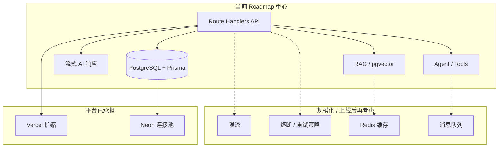

# 学习知识库：传统后端概念 × 本项目

> 类型：跨 Change 通用参考  
> 来源问题：项目规划的后端部分是否涉及高并发、熔断等传统后端思想？  
> 日期：2026-07-17

本文档把常见「传统后端」术语，对照本仓库的 **技术栈、roadmap、部署方案** 做映射，帮助判断：哪些已经在做、哪些被平台代劳、哪些留到上线/规模化时再考虑。

---

## 1. 本项目的后端长什么样？

```text
浏览器（React Client Components）
        ↓ HTTP / SSE
Next.js Route Handlers / Server Actions   ← 你的「后端代码」写在这里
        ↓ Prisma
PostgreSQL（Neon，含连接池 pooler）
        ↓ HTTPS
OpenAI Compatible API（外部 AI 服务）
```

**关键结论：**

- 不是单独再建 Java/Go 微服务集群，而是 **Next.js 全栈 + Serverless API**。
- `docs/vision.md` 的学习重心是 **现代 AI 应用架构**（流式、RAG、Agent），不是高并发电商/支付那类后端专题。
- `docs/deployment.md` 明确：开发阶段用 **Vercel + Neon**，功能稳定后再评估 Docker 自托管——同样不要求先搭 Redis、消息队列等中间件。

---

## 2. 概念速查表

| 概念 | 一句话 | 本项目 roadmap | 说明 |
|------|--------|----------------|------|
| **RESTful API** | 用 HTTP 动词操作资源 | ✅ Phase 1.3+ | 会话 CRUD、消息 API 等 Route Handlers |
| **ORM / 持久化** | 对象映射到数据库表 | ✅ Phase 1.1+ | Prisma + PostgreSQL |
| **连接池** | 复用 DB 连接，避免打满 | ⚙️ 已涉及 | Neon pooler；`lib/db.ts` Prisma 单例 |
| **事务** | 多步操作原子性 | ⚙️ 按需使用 | Prisma `$transaction`，未作为专题 |
| **流式响应** | 边生成边返回 | ✅ Phase 1.4 | ReadableStream / SSE，AI 打字机效果 |
| **分页** | 大数据集分批查询 | ✅ Phase 1.5 | 消息历史分页 |
| **错误处理** | 统一 4xx/5xx | ✅ Phase 1.3+ | API 路由返回标准错误 |
| **重试 / 超时** | 外部调用失败再试 | ⚙️ Phase 1.4 部分 | AI 流式错误处理，非完整熔断 |
| **限流** | 限制单位时间请求数 | ❌ 未规划 | 上线后防刷、控 AI 成本时很有用 |
| **熔断** | 下游挂了快速失败 | ❌ 未规划 | 调 OpenAI 不稳定时可后续加 |
| **降级** | 部分功能不可用时的备选 | ❌ 未规划 | 如 AI 不可用时的友好提示 |
| **缓存（Redis）** | 热点数据放内存 | ❌ 未规划 | RAG 检索、会话列表可后续缓存 |
| **消息队列** | 异步长任务、削峰 | ❌ 未规划 | 合同审查、Agent 长任务可考虑 |
| **负载均衡** | 多实例分摊流量 | ⚙️ 平台代劳 | Vercel 自动扩缩 |
| **微服务** | 拆成多个独立服务 | ❌ 不做 | 单体 Next.js，符合当前规模 |
| **API 网关** | 统一入口鉴权限流 | ❌ 未规划 | Serverless 场景通常不需要自建 |
| **向量检索** | 语义相似度搜索 | ✅ Phase 2 | pgvector + Embedding（AI 后端特色） |
| **工具调用 / Agent** | LLM 调外部能力 | ✅ Phase 3–4 | 比传统 CRUD 更偏 AI 架构 |

图例：**✅** roadmap 明确有 · **⚙️** 已涉及或平台/按需 · **❌** 当前未规划

---

## 3. 常见概念展开（带本项目语境）

### 3.1 高并发

**是什么：** 同一时刻大量用户访问，系统仍稳定、响应可接受。

**本项目：** roadmap **没有**专门讲压测、QPS 优化、读写分离。原因：

- 学习阶段目标用户量小，Vercel Serverless 会自动扩容。
- 瓶颈更常出现在 **OpenAI API 延迟与 token 成本**，而不是自建 API 的 CPU。

**以后可能遇到：** 消息列表、RAG 检索变慢 → 分页、索引、缓存；Serverless 冷启动 → 见 `docs/deployment.md` 的 duration/实例说明。

---

### 3.2 熔断（Circuit Breaker）

**是什么：** 调用下游（如支付、第三方 API）连续失败 N 次后，**暂时停止调用**，直接返回错误，避免拖垮整个系统；过一阵再「试探」是否恢复。

**类比：** 家里总闸跳闸——不是无限加重负载，而是先断开保护整体。

**本项目：** 未在 spec/roadmap 中规划。Change 1.4 会有 **AI 流式错误处理**，属于「单次请求失败怎么处理」，还不是完整的熔断器模式。

**何时值得加：** OpenAI 区域故障、429 限流频繁时，在 `lib/` 封装带熔断的 AI 客户端。

---

### 3.3 限流（Rate Limiting）

**是什么：** 每个 IP/用户/API Key 在单位时间内最多 N 次请求。

**本项目：** roadmap 未写。对个人学习 MVP 不是必须；**真实上线**时强烈建议（防刷、控制 AI 账单）。

**常见实现（将来可选）：** Vercel 中间件、`@upstash/ratelimit` + Redis、或 API 网关层。

---

### 3.4 降级

**是什么：** 核心依赖不可用时，提供功能减弱但可用的体验。

**例子：** 推荐服务挂了 → 仍显示商品列表，只是没有「猜你喜欢」。

**本项目：** 可简单理解为：AI 接口失败 → 返回「服务暂不可用，请稍后重试」，而不是整个站点 500。属于产品层设计，roadmap 未单独成章。

---

### 3.5 缓存

**是什么：** 把频繁读取的数据放更快的地方（内存/Redis），减少打数据库。

**本项目：** 当前直连 PostgreSQL 即可。Phase 2 RAG 后，**检索结果、Embedding** 是典型缓存候选；会话列表在会话很多时也可缓存。

---

### 3.6 消息队列（Queue）

**是什么：** 把耗时任务放进队列，后台 worker 异步执行；用于削峰、解耦。

**例子：** 用户上传合同 → 立即返回「处理中」→ 队列里跑审查 → 完成后通知。

**本项目：** Phase 3 合同审查、Phase 4 Agent 多步任务，若单次 HTTP 超时（Vercel 有 duration 上限），**将来**可能引入队列或后台 Job；当前 roadmap 仍是同步 API 为主。

---

### 3.7 连接池

**是什么：** 数据库连接创建昂贵；池子维护一批连接供多个请求复用。

**本项目：** **已经在用。** Neon 提供 `-pooler` 连接地址；`docs/deployment.md` 建议：迁移用直连，**运行时（尤其 Serverless 多实例）用 pooler**。这是传统后端里少数在本项目早期就相关的概念。

---

### 3.8 微服务 vs 单体

**是什么：** 微服务把系统拆成多个独立部署的服务；单体是一个应用包打天下。

**本项目：** ** deliberate 单体**——Next.js 一个 repo，Route Handlers 即后端。拆分微服务的学习成本高，与「先打通 AI 产品链路」的目标不一致。`docs/deployment.md` 也强调不引入 Vercel 专有依赖，便于以后 Docker 整包迁移，而不是拆服务。

---

## 4. 按 Roadmap 阶段：你会碰到哪些「后端」能力？

| 阶段 | Change 方向 | 偏传统后端 | 偏 AI 应用 |
|------|-------------|------------|------------|
| Phase 1 | 1.3 会话 API | REST、Prisma CRUD、Zustand 状态 | — |
| Phase 1 | 1.4 流式对话 | 流式 HTTP、错误处理 | Prompt、Streaming |
| Phase 1 | 1.5 持久化 | 分页、索引意识 | 消息入库策略 |
| Phase 1 | 1.7 上下文 | — | Token 窗口、截断 |
| Phase 2 | RAG | 查询性能 | Embedding、pgvector |
| Phase 3 | 合同审查 | 文件上传、长任务（或队列） | 文档解析 + LLM |
| Phase 4 | Agent | 超时、状态机 | Tool Calling、多步推理 |

---

## 5. 架构对照图



实线：已在或即将在 roadmap 中；虚线：非当前必修，按需引入。

---

## 6. 学习建议（针对本项目）

1. **优先掌握 roadmap 里的后端能力**：API 设计、Prisma、错误码、流式、分页——这些直接决定 ChatBot / RAG 能否跑通。
2. **不必为学习阶段强行上 Redis / Kafka**——复杂度与收益不匹配；等出现真实性能或超时问题时再引入，理解会更深。
3. **和传统后端最大的交集点**：连接池、REST、事务、分页、限流（上线）、外部 API 的可靠性（重试/熔断）。
4. **和传统后端最大的差异点**：流式 LLM、RAG、Agent、Token  economics——这是 `docs/vision.md` 里「现代 AI 应用架构」的核心。

---

## 7. 相关文档

| 文档 | 内容 |
|------|------|
| [`docs/vision.md`](../vision.md) | 技术栈、阶段目标、AI 能力演进 |
| [`docs/roadmap.md`](../roadmap.md) | 各 Change 交付物与时间线 |
| [`docs/deployment.md`](../deployment.md) | Vercel + Neon、连接池、Serverless 限制 |
| [`lib/db.ts`](../../lib/db.ts) | Prisma Client 单例 |

---

## 8. 标签与复习

- **标签**：`#backend` `#architecture` `#serverless` `#roadmap` `#general`
- **状态**：`#待复习`
- **延伸（可选深入）**：
  - 熔断模式：Martin Fowler — Circuit Breaker ⚠️需查证具体 URL
  - Vercel Serverless 函数限制 🔗 见 `docs/deployment.md`
  - Upstash Rate Limit（Serverless 友好限流方案）⚠️需查证
